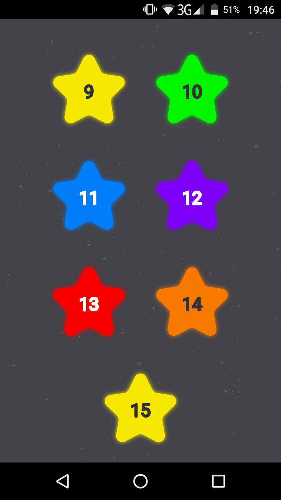
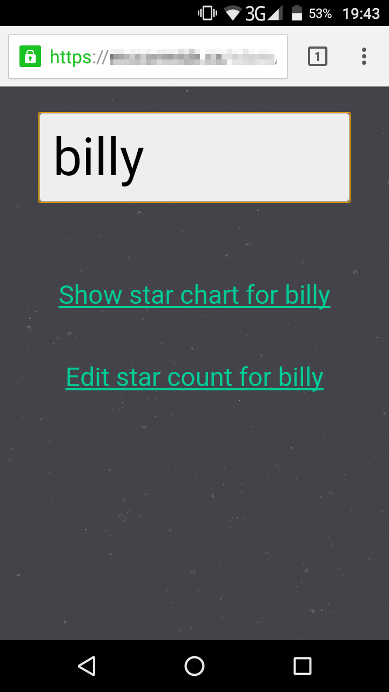
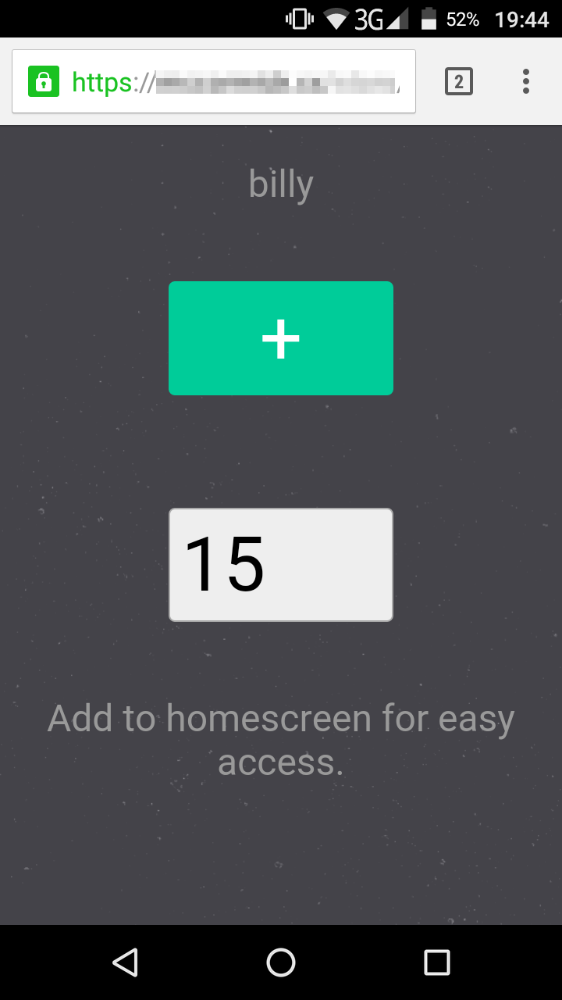
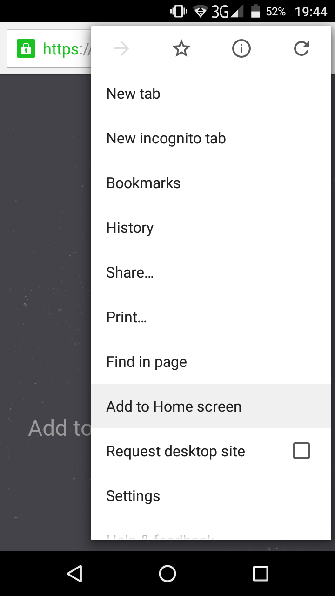
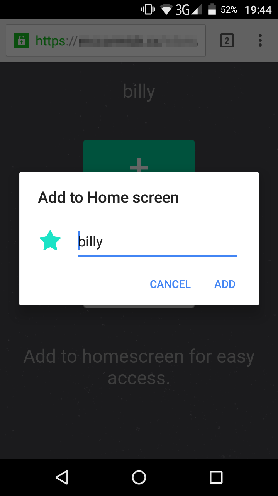
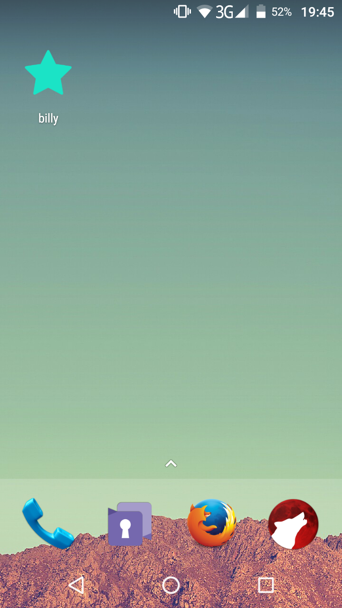
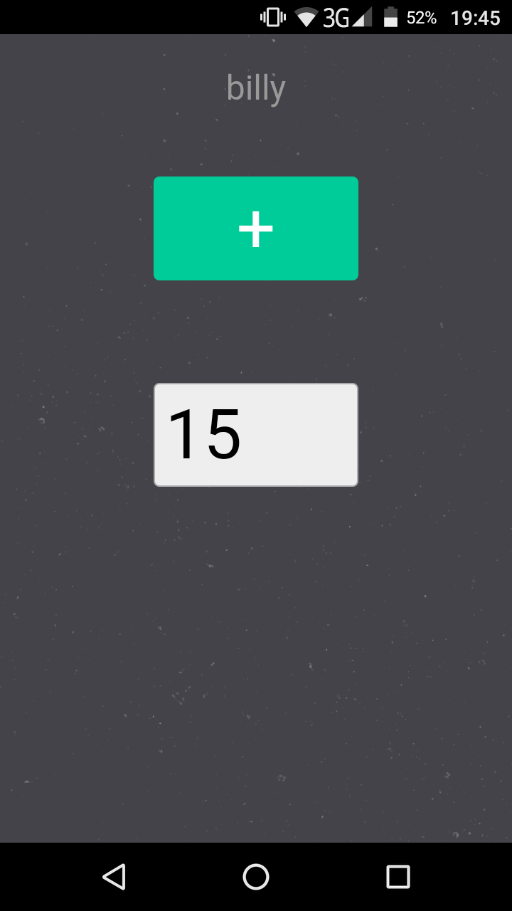

Keep track of your childrens' reward stars.

Self-hosted single-page web application.

Backend is PHP.

[Download the latest release](https://github.com/chr15m/starchart/releases/download/v1.0/starchart-v1.0.zip).

### Install ###

 * Unzip [the release](https://github.com/chr15m/starchart/releases/download/v1.0/starchart-v1.0.zip) and copy the contents of the folder up to a PHP enabled server.
 * Browse to the folder.

Hints:

 * Add the admin page for each kid to your phone's home screen for quick access.
 * Add the star chart for each kid to their devices or a screen somewhere in your home.

